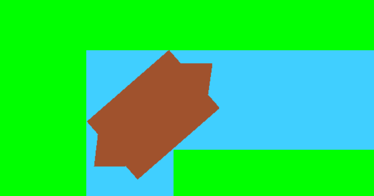
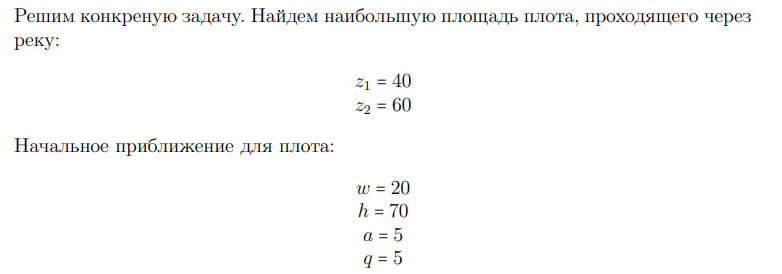
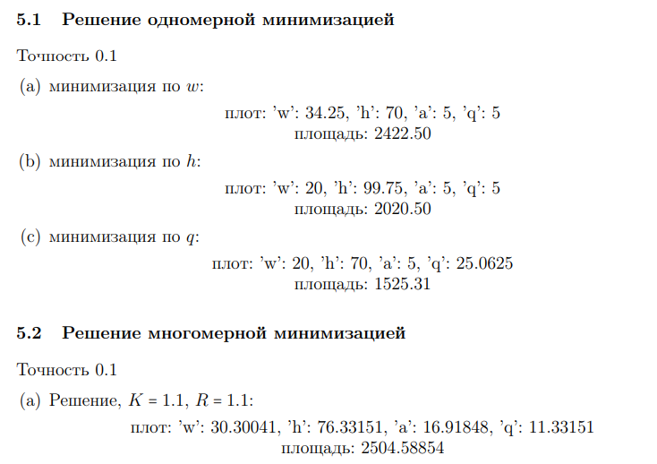

# Finding the maximum raft area of a given shape when the river turns the river by 90 degrees (+ visualisation: pygame)

- [Finding the maximum raft area of a given shape when the river turns the river by 90 degrees (+ visualisation: pygame)](#finding-the-maximum-raft-area-of-a-given-shape-when-the-river-turns-the-river-by-90-degrees--visualisation-pygame)
  - [Description](#description)
  - [Get started](#get-started)
  - [Project structure](#project-structure)
  - [Results](#results)

## Description

    The problem of finding the maximum area of the raft of a given shape, at which it is possible to pass the river bend in 90 degress.
    The shape of the raft: a rectangle with two equal isosceles triangles on two opposite sides.
    Choose the upper left corner of the river bend as the origin of coordinates (0, 0).

## Get started

```bash
git clone https://github.com/IMZolin/maximization-raft-area <your project name>
cd <your project name>
pip install -r requirements.txt
```

## Project structure

```bash
├───images              # some results
├───report              # report + presentation (ru)
│   ├───Гвоздев_Золин_Хламкин.pptx
│   └───coursework_opt_methods.pdf 
├───src                 # code
│   ├───one_d_min_lib  # One-dimensional minimization lib    
│   │   ├───golden_egg.py # Golden Ratio Method
│   │   ├───One_D_Problem_file.py # One dimension min class
│   │   ├───Trial_Point_Method_file.py # Trial point Method
│   │   └───uniform_search.py # Uniform search method
│   ├───vizualization_lib  
│   │   ├───Colors.py 
│   │   ├───main.py # executable file
│   │   ├───Params.py # Task params
│   │   ├───Raft.py # Raft class
│   │   ├───River.py # River class
│   │   └───Window.py # Window with Input fields
│   ├───zoitendeik_lib # Multivariate minimization lib
│   │   ├───executable.py 
│   │   └───Zoitendeik.py 
│   ├───constraints.py  # the stages for algorithm
│   ├───executable.py 
│   ├───main_algorithm.py  # optimisation algorithm
│   ├───multi_min.py # MAIN file
│   ├───raft_parametrs.py # connection(algorithm, visualization)
│   ├───raft.py # support Raft class for optimisation
│   ├───Test_1.py  
│   ├───Test_2.py 
│   └───Test_3.py 
```

## Results

1. Visualisation (pygame)


2. Example solution(ru)

